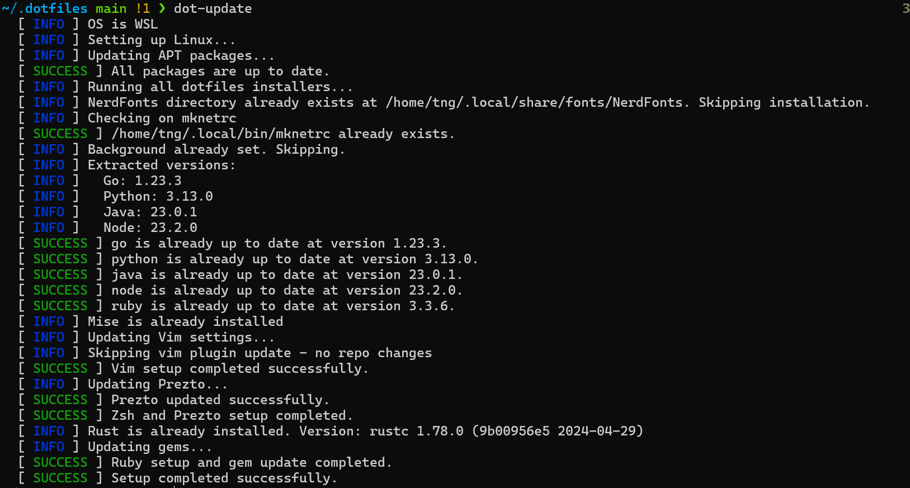

# Dotfiles

Your dotfiles personalize your system. These are mine, forked from [holman/dotfiles](https://github.com/holman/dotfiles.git).  
Originally used on macOS, these dotfiles now also support Ubuntu, MacOs, and Windows/WSL.

## Overview

These dotfiles automate the setup of a personalized development environment. They include:
- A `script/bootstrap` command to install prerequisites.
- Development setups for multiple programming languages using **Mise**, as defined in `lang.sh`.
- Easy customization via `zshrc.symlink`, `gitconfig.local`, and other topical configurations.

## Table of Contents
1. [Installation](#installation)
   - [Windows](#windows)
   - [Ubuntu/WSL/macOS](#ubuntu-wsl-macos)
2. [Usage](#usage)
   - [dot-update](#dot-update)
   - [Customization](#customization)
3. [Components](#components)
4. [Development Tools Setup](#development-tools-setup)
5. [Troubleshooting](#troubleshooting)
6. [Notes and Links](#notes-and-links)

## Installation

### Windows
1. Click the boxstarter icon to install prerequisites:  
  [](https://boxstarter.org/package/nr/url?https://raw.githubusercontent.com/gambtho/dotfiles/refs/heads/main/win/boxstarter.ps1)  
  - After this, continue with the WSL setup below.

### Ubuntu/WSL/macOS
1. Clone the repository and use the setup scripts:
   ```sh
   git clone https://github.com/gambtho/dotfiles.git ~/.dotfiles
   cd ~/.dotfiles
   script/bootstrap
   reload!
   dot-update
   ```

2. What `script/bootstrap` Does:
- Symlinks configuration files from `.dotfiles` to your home directory.
- Installs necessary tools and dependencies using [Mise](https://github.com/jdx/mise) and other platform-specific tools.

3. Customize Git settings by editing `git/gitconfig.local.symlink`.  
   - An example file is provided at `./git/gitconfig.local.symlink.example`.
   - Current version assumes use of a gpg key, and windows git credential manager
   - You should copy and modify it to include your Git configuration, such as:
     ```ini
     [user]
         name = Your Name
         email = your.email@example.com
     [commit]
         gpgsign = true
     ```

---

## Usage

### dot-update
This script ensures all installed tools, configurations, and dependencies stay up to date.  
Here's an example of `dot-update` running:  


---

## Components

### File Organization
The structure is organized by topics:
- **bin/**: Contains scripts added to your `$PATH`.
- **linux/aptfile** or **mac/brewfile**: Lists applications to install during setup.
- **topic/\*.zsh**: Configuration files automatically loaded into your shell.
- **topic/path.zsh**: Defines `$PATH` or similar variables and is loaded first.
- **topic/install.sh**: Executes during the setup process to install tools or configurations.
- **topic/\*.symlink**: Files symlinked to `$HOME` for use by your shell or applications.

---

## Development Tools Setup

Using **Mise**, the setup supports multiple programming languages. The versions are defined in `mise/mise.local.toml.symlink`. Current languages (modify in `mise/lang.sh`):

  
  
  

  
  
  
 
  

---

## Notes and Links

Additional useful tools and configurations:
- [zsh-bench (Zsh benchmarking)](https://github.com/romkatv/zsh-bench)
- [Faster Zsh](https://htr3n.github.io/2018/07/faster-zsh/)
- [Speeding Up Zsh](https://blog.jonlu.ca/posts/speeding-up-zsh)

```
##### timer for troubleshooting
timer=$(($(gdate +%s%N)/1000000))
now=$(($(gdate +%s%N)/1000000))
elapsed=$(($now-$timer))
echo $elapsed":" $plugin
### or unncomment and run zprof
zmodload zsh/zprof
# zprof at end of file
```


